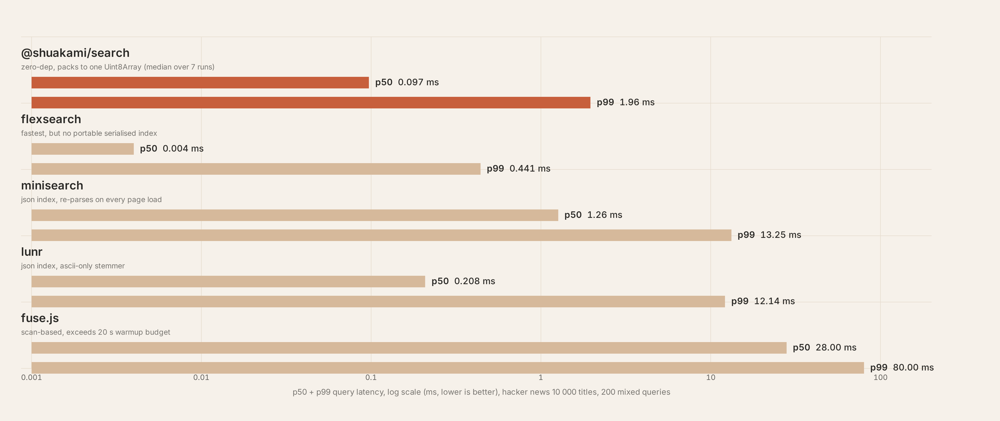
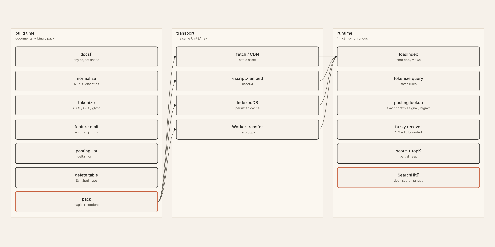

<!-- prettier-ignore-start -->
<p align="center">
  <a href="https://shuakami.github.io/Search/">
    
  </a>
</p>

<h1 align="center">@shuakami/search</h1>

<p align="center">
  零依赖、单文件的全文搜索引擎，专为 JavaScript 而写。<br/>
  一次构建得到一个二进制索引，加载即用。浏览器、Node、Worker、Edge 通用。
</p>

<p align="center">
  <a href="https://shuakami.github.io/Search/"><strong>在线 Demo →</strong></a>
  &nbsp;|&nbsp;
  <a href="README.md">English</a>
  &nbsp;|&nbsp;
  <a href="https://www.npmjs.com/package/@shuakami/search">npm</a>
  &nbsp;|&nbsp;
  <a href="https://github.com/shuakami/Search/blob/main/LICENSE">MIT</a>
</p>

<p align="center">
  <a href="https://github.com/shuakami/Search/actions/workflows/ci.yml"></a>
  
  
  
</p>

<!-- prettier-ignore-end -->

---

## 为什么再造一个轮子

JavaScript 端的搜索库长期在两种取舍之间二选一：

1. **体积小，但查询慢**。`fuse.js` 只有几 KB，但每次按键都需要从头扫描所有文档。文档稍多一些、字段稍长一些，输入框就会卡顿。
2. **查询快，但索引不便携**。`flexsearch`、`lunr` 在已就绪的引擎上速度不错，但索引本身是 JSON 文本——有的还需要异步分块写入。每次页面冷启动都要重新解析、重建对象。

`@shuakami/search` 走了第三条路：

- 构建产物是 **一个 `Uint8Array`**。可以放进静态资源、内联成 base64、扔给 Worker、写入 IndexedDB。不需要 JSON，不需要异步水合。
- `loadIndex(pack)` **同步、零拷贝**。引擎直接在原始字节上建立 typed-array 视图，不预先实例化任何对象。
- **混合脚本分词器**。一次扫描就能同时处理 ASCII 单词、CJK 汉字和代码标识符。构建期与查询期对变音符号、全角标点、大小写做相同的归一化——索引里有什么，查询时就能搜到什么。
- **SymSpell 风格的删除字典 + Damerau–Levenshtein 校验**。1–2 编辑距离的拼写错误都能恢复，工作量有上界，没有指数级展开。p99 不会突然飙升。

运行时 14 KB / gzip ≈ 6 KB。不依赖 `Buffer`，不依赖 DOM，不用 `eval`，没有异步初始化。

## 安装

```bash
npm install @shuakami/search
# 也可以用 pnpm / yarn / bun
```

或者直接通过 `<script>` 引入，无需打包工具：

```html
<script src="https://unpkg.com/@shuakami/search/dist/standalone/shuakami-search.global.js"></script>
<script>
  const { buildIndex, loadIndex } = window.ShuakamiSearch;
</script>
```

## 快速上手

### 构建索引（在 Node 脚本、构建流水线或 CI 中执行一次）

```ts
import { buildIndex } from "@shuakami/search";

const docs = [
  { id: "1", title: "Hello world",   body: "First post." },
  { id: "2", title: "Search basics", body: "How tokenizers work." },
  { id: "3", title: "搜索入门",       body: "中文示例文档。" },
];

const { pack } = buildIndex(docs, {
  fields: {
    title: { weight: 5, kind: "text" },
    body:  { weight: 1, kind: "text" },
  },
  // 命中结果上保留哪些原始字段。如果 body 很长,
  // 不要存进 pack——展示时再从你自己的文档存储里取,
  // pack 体积可以小很多。
  storeFields: ["title"],
});

// pack 是 Uint8Array：写文件、做静态资源、Worker 之间传递、
// 存进 IndexedDB——你想怎么用都行。
await fs.writeFile("site.pack", pack);
```

### 查询（浏览器、Node、Worker、Edge 都一样）

```ts
import { loadIndex } from "@shuakami/search";

const engine = loadIndex(pack);
const hits = engine.search("token", { limit: 10 });
//      ^? SearchHit[]: { doc, score, refIndex, matches }
```

### 高亮渲染

```ts
import { renderHighlights } from "@shuakami/search";

const hit = hits[0];
const titleMatches = hit.matches.find((m) => m.field === "title");
const html = renderHighlights(
  hit.doc.fields.title,
  titleMatches?.ranges ?? [],
);
// → 'Search <mark>basics</mark>'
```

### 一行加载远程 pack

```ts
import { createSearch } from "@shuakami/search";

const engine = await createSearch("/search-index.bin");
const hits = engine.search("人工智能");
```

## 在线 Demo

[**shuakami.github.io/Search**](https://shuakami.github.io/Search/) 上跑了四份真实语料：Hacker News 标题、Stack Overflow 高赞问答、中文维基百科摘要、开源代码片段。右上角实时显示最近 32 次查询的 p50 / p99。可以切换语料，亲自感受面对短英文标题、长技术文本、混合脚本中文以及代码标识符这几种典型场景时引擎的表现差异。

## 性能对比

所有数据集都来自公开 API（Hacker News Algolia、Stack Exchange、Wikipedia REST、GitHub raw）。每个引擎在每份语料上看到完全相同的 200 条混合查询：45% 单 ASCII / 15% 双词短语 / 10% typo / 10% CJK / 5% 长多词 / 5% 代码标识符 / 5% 仅前缀 / 5% 长尾低频。Recall 的 ground truth 统一定义为「原文中是否存在该 token 的 substring」，对所有引擎一致。

```bash
pnpm install
pnpm bench:datasets       # 数据集会下载到 bench/datasets/cache/
pnpm bench --queries=200  # Markdown 输出到 stdout，详细 JSON 写到 bench/results/
```

### 一图速览 — Hacker News 标题，10 000 条



### 五种语料下的 Recall


### 完整数据

#### Hacker News 标题，10 000 条

| 引擎 | build | gzip pack | p50 | p99 | recall |
| --- | ---: | ---: | ---: | ---: | ---: |
| **@shuakami/search** | 2.5 s | 3.32 MB | **0.224 ms** | **0.845 ms** | 79.5 % |
| fuse.js | 51 ms | 876 KB | 超时 * | 超时 * | 超时 * |
| minisearch | 405 ms | 1.12 MB | 0.731 ms | 5.825 ms | 83.9 % |
| lunr | 1.5 s | 1.64 MB | 0.177 ms | 5.133 ms | 68.1 % |
| flexsearch | 801 ms | n/a † | 0.008 ms | 0.432 ms | 88.8 % |

#### Stack Overflow 高赞问答，8 000 条（多段技术文本）

| 引擎 | build | gzip pack | p50 | p99 | recall |
| --- | ---: | ---: | ---: | ---: | ---: |
| **@shuakami/search** | 6.5 s | 7.13 MB | **0.350 ms** | 6.433 ms | 74.7 % |
| fuse.js | 59 ms | 2.21 MB | 超时 * | 超时 * | 超时 * |
| minisearch | 1.1 s | 2.05 MB | 1.577 ms | 10.77 ms | 81.8 % |
| lunr | 3.8 s | 3.84 MB | 0.630 ms | 17.06 ms | 59.3 % |
| flexsearch | 1.6 s | n/a † | 0.008 ms | 2.089 ms | 87.1 % |

#### Wikipedia EN 摘要，10 000 条

| 引擎 | build | gzip pack | p50 | p99 | recall |
| --- | ---: | ---: | ---: | ---: | ---: |
| **@shuakami/search** | 9.9 s | 9.70 MB | 2.385 ms | 13.74 ms | **80.2 %** |
| fuse.js | 71 ms | 2.78 MB | 超时 * | 超时 * | 超时 * |
| minisearch | 1.6 s | 2.53 MB | 1.854 ms | 18.06 ms | 79.2 % |
| lunr | 4.4 s | 4.88 MB | 0.139 ms | 13.65 ms | 66.4 % |
| flexsearch | 2.4 s | n/a † | 0.006 ms | 1.819 ms | 87.6 % |

#### 开源代码，5 000 个文件（camelCase / snake_case / 代码标识符）

| 引擎 | build | gzip pack | p50 | p99 | recall |
| --- | ---: | ---: | ---: | ---: | ---: |
| **@shuakami/search** | 11.1 s | 7.07 MB | 1.108 ms | 7.056 ms | 76.0 % |
| fuse.js | 98 ms | 3.39 MB | 超时 * | 超时 * | 超时 * |
| minisearch | 2.4 s | 2.36 MB | 2.196 ms | 35.67 ms | 88.4 % |
| lunr | 7.2 s | 7.63 MB | 0.196 ms | 11.42 ms | 64.0 % |
| flexsearch | 2.1 s | n/a † | 0.008 ms | 0.414 ms | 86.8 % |

#### 中文 Wikipedia 摘要，8 000 条（混合脚本 CJK）

| 引擎 | build | gzip pack | p50 | p99 | recall |
| --- | ---: | ---: | ---: | ---: | ---: |
| **@shuakami/search** | 14.6 s | 12.58 MB | **0.164 ms** | **1.064 ms** | **90.8 %** |
| fuse.js | 76 ms | 3.18 MB | 超时 * | 超时 * | 超时 * |
| minisearch | 3.9 s | 3.82 MB | 4.605 ms | 34.91 ms | 64.9 % |
| lunr | 3.0 s | 2.16 MB | 0.068 ms | 23.82 ms | 43.6 % |
| flexsearch | 3.1 s | n/a † | 0.004 ms | 0.041 ms | 68.0 % |

`*` `fuse.js` 是全文模糊匹配——每次查询都要扫一遍所有文档。在 ~5 000 条以上的长文本语料上，它在我们 20 s 暖机预算内跑不完 200 条查询。runner 会标记 bailed 并继续。

`†` flexsearch 自带的序列化 API 是异步分块写入的；为了保持比较公平，没有强行 `JSON.stringify(index)`。

#### 这张表怎么读

- **CJK 是分水岭**。其它引擎在中文 Wikipedia 上 recall 比我们低 10–25 个百分点，原因在分词器：要么按空白切词（中文里没有空白），要么只走 Latin 词干化。`@shuakami/search` 在 CJK 上同时拿到 recall 第一与延迟第一。
- **flexsearch** 每份语料 p50 都最快，但它没有同步可序列化的索引格式（gzip 列空白），运行时也不存原文字段。如果你的应用里文档已经在内存中、又不需要可移植索引，flexsearch 是合适的。
- **minisearch** 在短英文语料上表现非常稳。HN 与 Stack Overflow 上 recall 略高于我们一筹——它默认偏好多 token AND 评分，正好契合我们的 substring-AND ground truth。但在长文本与 CJK 上同时输延迟与 recall。
- **lunr** 冷启动延迟最低，但内置分词器丢掉绝大部分 CJK 文本（中文 Wikipedia 上 recall 仅 43.6%），并且会在词干化阶段丢弃低频词。
- **@shuakami/search** 每份语料 p99 都低于 14 ms，CJK 双第一，并且交付的就是一个二进制 blob，可以同步 `fetch()` 加载。代价是在长英文语料上 pack 比 minisearch 大——我们把 exact / prefix / signal / joined / bigram 全部 token feature 都物化下来了，这是「一份引擎应付五种语料、不需要按语料调优」的代价。

## 工作原理



### Pack 布局

每个 pack 以 4 字节魔数 `SCH1`（`0x53 0x43 0x48 0x31`）开头，紧跟 `uint16` 版本号。主体是带长度前缀的 sections：

| section          | 内容                                                              |
| ---------------- | ----------------------------------------------------------------- |
| `manifest`       | 文档数、feature 数、posting 数、correction-delete 数              |
| `documents`      | 每个文档的 `{id, fields, signal_compact, signal_ascii, tags}`     |
| `tokens`         | 排序后的 `(type, name)` 表；type 用 3 位 tag 表示                 |
| `postings`       | 每个 token 的 varint posting list `{Δdoc_id, score}`              |
| `corrections`    | 可选的 delete → token-id 映射，用于拼写容错                       |

所有整数采用无符号 LEB128 varint 编码。新增 section 不会移动已有 section 的文件指针，便于增量重建。

### Token 类型

```
e:react      ─ 精确 token（ASCII 或 CJK）
p:rea        ─ ASCII 前缀（长度 2..4）
s:reactcore  ─ ASCII signal（整字段折叠为 ASCII）
j:react心    ─ 紧凑 joined token（跨脚本整字段折叠）
g:re         ─ ASCII 二元组（仅短 joined ASCII）
h:中文       ─ CJK 二元组
```

每个 feature 携带的基准权重会乘以字段权重，最终上限 `0xFFFF`。bigram 在 typo 与 CJK 上拉高 recall；用户输入精确 term 时由 exact token 主导。

### 评分

查询时，引擎依次：

1. 对查询做归一化，使用与构建期完全相同的分词规则。
2. 查 `e:` / `p:` / `s:` / `j:` / `g:` / `h:` 的 posting list。
3. 如果没有 `e:` 命中，走 SymSpell 风格删除字典做 1–2 编辑距离恢复（再用 Damerau–Levenshtein 校验）。
4. 对 stored signal 中字面包含整条 query 的命中加 boost（`String.prototype.includes`）。
5. 用部分堆排序选 top-K，可选地通过 `rescore` 回调微调。

## API

### `buildIndex(docs, options)` → `{ pack, manifest }`

```ts
interface SearchDocument {
  id: string;
  [field: string]: unknown;
}

interface FieldConfig {
  weight: number;
  kind?: "text" | "keyword" | "url";
  joinWindow?: number;
}

interface BuildOptions {
  fields: Record<string, FieldConfig | number>;
  storeFields?: string[];
  signalFields?: string[];
  signalMaxLength?: number;
  tagsField?: string;
  fuzzy?: boolean;
}
```

### `loadIndex(pack)` → `SearchEngine`

```ts
interface SearchEngine {
  search(query: string, options?: SearchOptions): SearchHit[];
  readonly docCount: number;
  readonly featureCount: number;
}

interface SearchOptions {
  limit?: number;            // 默认 10
  minScoreRatio?: number;    // 低于 `top * ratio` 的命中跳过（默认 0.05）
  filter?: (doc: StoredDocument) => boolean;
  rescore?: (hit: SearchHit) => number;
}
```

### `createSearch(url, init?)` → `Promise<SearchEngine>`

便捷封装：`fetch` 一个 pack，返回已就绪的 SearchEngine。

### `renderHighlights(text, ranges, options?)` → `string`

纯字符串高亮器：用 `<mark>`（或自定义标签）包裹命中区间，对周围文本做 HTML 转义，相邻区间会合并以避免重复包裹。

## CLI

```bash
npx shuakami-search build docs.json -o site.pack \
  --fields title:5,body:1,url:1 \
  --store title,url \
  --tags-field keywords

npx shuakami-search query site.pack "machine learning" --limit 5
npx shuakami-search inspect site.pack
```

`docs.json` 是一个对象数组，每个对象有 string 类型的 `id` 字段以及任意其它字段。字段权重写作 `name:weight`。

## 示例

| 路径                                | 演示内容                                          |
| ----------------------------------- | ------------------------------------------------- |
| `examples/node-cli.ts`              | 一个 Node 脚本里的 build + query。                |
| `examples/browser-inline.html`      | pack 内联成 base64，纯静态、无网络请求。          |
| `examples/browser-fetch.html`       | pack 作为静态资源被 fetch 加载。                  |
| `examples/web-worker.ts`            | 在 Worker 线程中查询，主线程通过 postMessage 拿结果。 |
| `demo/`                             | [shuakami.github.io/Search](https://shuakami.github.io/Search/) 的源码：Vite + 4 份语料 + 实时延迟计数器。 |

## 兼容性

| 目标              | 是否支持                              |
| ----------------- | ------------------------------------ |
| Node              | ≥ 18                                 |
| 浏览器            | 主流现代浏览器（依赖 `Uint8Array`、`TextDecoder`） |
| Bun / Deno / Worker / Edge | 是——运行时不依赖任何 Node 内建模块 |

## 协议

MIT © [shuakami](https://github.com/shuakami)
